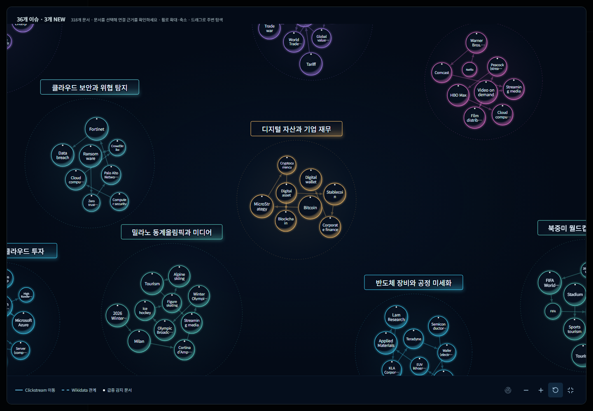
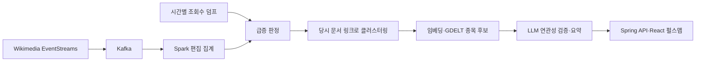

# WikiPulse

위키백과의 관심 변화에서 이슈를 찾고, 근거가 있는 미국 상장 종목을 연결하는 서비스입니다.



## 주요 기능

- **펄스맵**: 시점별 문서·이슈 그래프, 날짜 탐색, 확대·이동, 문서 근거 확인
- **이슈 탐색**: 이슈 기록, 요약·섹션형 리포트, 관련 종목과 검증 근거
- **종목 탐색**: 기업 정보, 주가 차트, 이슈 시점 마커
- **계정·보관함**: 세션 기반 로그인, 이슈 북마크, 관심종목
- **과거 재생**: LIVE와 같은 판정 규칙으로 역사적 데이터를 처리

## 데이터 흐름



사람 편집 1건 이상은 조회수 검사 후보를 만드는 신호입니다. 기준선 표본이 충분하면 조회수 z-score 3 이상, 평소 대비 2배 이상, 시간별 조회수 100 이상을 모두 충족해야 급증으로 확정합니다. 원본 미도착과 실제 조회수 0은 구분하며, 지연된 조회수는 도착 후 재판정합니다.

클러스터링은 시점별 조회수 상위 20개와 문서별 24시간 쿨다운을 적용한 뒤, **해당 시점 revision의 직접 링크**로 구성합니다. 과거 화면의 지표는 스냅샷에 고정하고 AI 결과는 이전 시점에서만 재사용해 미래 정보 혼입을 방지합니다.

종목 연결은 임베딩 후보와 GDELT 근거를 합친 뒤 사업 관련성을 검증합니다. 주가 방향이나 수익률을 예측하는 기능은 아닙니다.

## 기술 구성

| 영역 | 구성 |
| --- | --- |
| 프론트엔드 | React 19, Vite 8, SVG·d3-force, React Three Fiber·Three.js 온보딩 |
| 백엔드 | Java 17, Spring Boot 3.5, Spring Security, Session JDBC |
| 저장소 | PostgreSQL 17, pgvector, 1536차원 종목 임베딩 |
| 데이터 처리 | Python 3.11, Kafka 3.9, Spark 3.5.3, HDFS |
| 배포 구성 | Docker Compose, Nginx, GitHub Actions 검증 |

## 빠른 실행

### 화면만 보기

Node.js 22.12 이상과 npm이 필요합니다. 기본 mock 모드는 백엔드와 외부 API 키 없이 실행됩니다.

```sh
cd frontend
npm ci
npm run dev
```

[온보딩](http://127.0.0.1:5174/) · [펄스맵](http://127.0.0.1:5174/#/pulse)

mock 화면의 시계열·가격·관계는 시연용 합성 데이터입니다. 실제 데이터와 혼동하지 않도록 화면의 데이터 출처를 확인합니다.

### 전체 로컬 스택

Docker Compose와 Python 3이 필요합니다. 저장소 루트에서 실행합니다.

```sh
python tools/setup_local_env.py
docker compose up -d --build
```

설정 도구는 무작위 DB 비밀번호가 들어간 로컬 `.env`를 만들며 기존 파일은 덮어쓰지 않습니다. 빈 DB에는 기본적으로 이슈가 없습니다. 시연 데이터 적재와 상세 실행 방법은 [Docker 가이드](docker/README.md)를 참고하세요.

외부 수집·AI 워커는 기본 OFF입니다. 수집에는 CONTACT_EMAIL, AI 기능에는 사용자 소유의 LLM_GATEWAY_BASE_URL과 LLM_GATEWAY_KEY가 필요합니다. 연결 계약과 Python 도구의 설정은 [AI 게이트웨이 설정](docs/AI_GATEWAY.md)을 참고하세요.

## 저장소 안내

| 경로 | 역할 |
| --- | --- |
| `frontend/` | 온보딩, 펄스맵, 이슈·종목·계정 화면 |
| `backend/` | 조회 API, 인증·저장 기능, AI 워커 |
| `data-pipeline/` | 수집, 기준선, 급증 판정, 클러스터링·리플레이 |
| `db/` | SQL 마이그레이션과 데이터 계약 검증 |
| `ai/` | 알고리즘·매칭 방식의 실험과 근거 |
| `infra/` | Docker Compose·Nginx 배포 구성 |

[요구사항](docs/requirements-v1.md) · [기술 명세](docs/tech-spec-v1.md) · [API](docs/api-v1.md) · [ERD](docs/erd-v1.md) · [기여자](AUTHORS.md)

## 검증

```sh
python tools/check_compose_env.py
cd frontend
npm run lint
npm run test:data
npm run build
```

백엔드는 Java 17 환경에서 `backend/gradlew test` 또는 Windows의 `backend/gradlew.bat test`로 검증합니다. GitHub Actions에서 환경변수 전달 검사, 프론트엔드 lint·데이터 테스트·빌드, 백엔드 테스트를 실행합니다.
