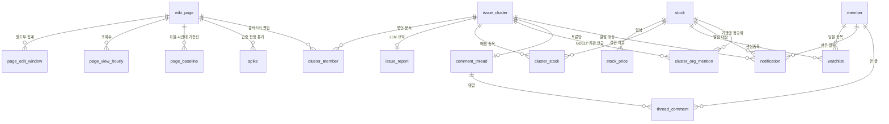

# ERD — WikiPulse (WikiPulse)

- 버전: **v0.1 (2026-09-08)**. 데이터 모델 v1(WP-35) 기준
- 🔴 **DDL이 정본이다**: `db/migrations/V1__initial_schema.sql`. 컬럼 타입·제약·이유는 그 파일 주석에 있다.
- 이 문서는 **테이블 사이의 관계**만 다룬다 — 무엇이 무엇을 참조하고, 지웠을 때 무엇이 따라 죽는가. 컬럼 사전을 여기 옮겨 적지 않는다 (두 벌이 되면 한쪽만 갱신된다).
- 설계 근거(왜 PostgreSQL 하나인가, 왜 `page_id`가 없는가, 왜 ENUM이 아닌가)는 [db/README.md](../db/README.md).

---

## 1. 전체



읽는 방향은 명세 §3.2 흐름과 같다.

```
wiki_page → page_edit_window → (page_baseline 대비) → spike
                             ↘ page_view_hourly ↗
spike → issue_cluster ─┬─ cluster_member   (어떤 문서가 묶였나)
                       ├─ issue_report     (LLM 요약)
                       ├─ cluster_org_mention (GDELT 기관 — LLM 의 RAG 입력)
                       └─ cluster_stock    (매칭 결과)  ←─ stock (+ pgvector 임베딩)
```

---

## 2. 키와 참조

| 테이블 | PK | 밖으로 나가는 FK | 비고 |
| --- | --- | --- | --- |
| `wiki_page` | `id` (대리키) | — | 자연키는 `UNIQUE (wiki, title)`. EventStreams에 `page_id`가 없다 |
| `page_edit_window` | `(page_id, window_start)` | `page_id` | 슬라이딩이라 편집 1건이 여러 행에 걸린다 |
| `page_view_hourly` | `(page_id, ts_hour)` | `page_id` | |
| `page_baseline` | `(page_id, hour_of_week)` | `page_id` | `hour_of_week` 0~167 |
| `spike` | `id` | `page_id` | `UNIQUE (page_id, window_start)` — 같은 창을 두 번 못 넣는다 |
| `issue_cluster` | `id` | — | `snapshot_ts` 가 시점을 가른다 |
| `cluster_member` | `(cluster_id, page_id)` | `cluster_id`, `page_id` | 한 문서가 여러 클러스터에 들어갈 수 있다 |
| `issue_report` | `cluster_id` | `cluster_id` | PK가 곧 FK = **1:1** |
| `stock` | `ticker` | — | 티커가 자연키. 대리키 없음 |
| `stock_price` | `(ticker, trade_date)` | `ticker` | 약 640만 행, 파티셔닝 없음 |
| `cluster_stock` | `(cluster_id, ticker)` | `cluster_id`, `ticker` | **매칭 결과의 정본** |
| `cluster_org_mention` | `(cluster_id, org_name)` | `cluster_id`, `ticker`(nullable) | `ticker`가 NULL = 종목 마스터에 없는 기관 |
| `member` | `id` | — | `email` UNIQUE |
| `watchlist` | `(member_id, ticker)` | `member_id`, `ticker` | 복합 PK가 중복 담기를 막는다 |
| `notification` | `id` | `member_id`, `cluster_id`(nullable), `ticker`(nullable) | |
| `comment_thread` | `id` | `cluster_id` | `UNIQUE (cluster_id)` = **1:1** |
| `thread_comment` | `id` | `thread_id`, `member_id`(nullable) | `deleted_at` soft delete |

**대리키 vs 자연키**: `wiki_page`는 대리키(문서 이동으로 title이 바뀐다), `stock`은 자연키 `ticker`(티커는 안정적이고 API 경로·화면에 그대로 쓴다). `issue_cluster`도 대리키다 — 같은 사건이 시점마다 다른 행이라 자연키가 성립하지 않는다.

---

## 3. 삭제 전파

무엇을 지우면 무엇이 따라 죽는지가 이 스키마에서 가장 조용히 틀리기 쉬운 부분이다.

| 지우는 것 | CASCADE (따라 죽음) | SET NULL (남되 링크만 끊김) |
| --- | --- | --- |
| `wiki_page` | `page_edit_window`, `page_view_hourly`, `page_baseline`, `spike`, `cluster_member` | — |
| `issue_cluster` | `cluster_member`, `issue_report`, `cluster_stock`, `cluster_org_mention`, `comment_thread` → `thread_comment` | `notification.cluster_id` |
| `stock` | `stock_price`, `cluster_stock`, `watchlist` | `notification.ticker`, `cluster_org_mention.ticker` |
| `member` | `watchlist`, `notification` | `thread_comment.member_id` |

규칙은 하나다: **파생 데이터는 따라 죽고, 사람이 만든 것은 남는다.**

- 상장폐지로 종목을 지워도 알림 본문은 남는다 — 사용자가 받은 알림이 사라지면 안 된다.
- 탈퇴해도 쓴 글은 남는다. `member_id`가 NULL이면 화면에 "삭제된 사용자".
- 반대로 클러스터를 지우면 **토론방까지 사라진다.** 클러스터는 시점의 함수라 재계산으로 지워질 수 있다 — ⚠️ 리플레이 스냅샷을 다시 계산할 때 토론이 날아갈 수 있다. 아래 5절.

---

## 4. 벡터

`stock.embedding vector(1536)` + HNSW 코사인 인덱스 하나. 별도 벡터 DB가 없는 게 이 ERD의 핵심 선택이다 — Top-K 결과에 티커·섹터·주가를 붙이는 조인이 SQL 한 번에 끝난다.

```sql
SELECT s.ticker, s.name, 1 - (s.embedding <=> :q) AS similarity
FROM stock s
WHERE s.embedding IS NOT NULL
ORDER BY s.embedding <=> :q     -- <=> 여야 HNSW 인덱스를 탄다
LIMIT :k;
```

⚠️ **이슈 쪽 임베딩을 담는 컬럼이 없다.** 지금은 매칭 시점에 계산해 쓰고 버리는 전제다. 같은 클러스터를 여러 번 조회할 때 매번 임베딩을 다시 만들면 GATEWAY 크레딧이 샌다 — WP-49(판정 재사용 규칙)에서 `issue_cluster.embedding` 컬럼을 둘지 정한다.

---

## 5. v0.1에서 안 푼 것

- **리플레이 스냅샷과 토론의 수명이 엮여 있다.** `comment_thread`가 `issue_cluster`에 CASCADE로 달려 있는데 클러스터는 재계산 대상이다. 토론을 "사건"에 붙이려면 스냅샷을 가로지르는 상위 개념(사건 id)이 필요하다. MVP에서는 LIVE 클러스터에만 토론이 붙는다고 보고 넘어간다.
- **이슈 임베딩 저장 위치** (4절)
- **`page_edit_window` 보존 기간** — 정해지면 파티션·삭제 잡이 붙는다
- **마이그레이션 도구** — 파일명만 Flyway 규칙(`V1__`)을 따랐다. Flyway/Liquibase 확정은 백엔드 합의 사항
- **인증 컬럼** — `member.password_hash`가 nullable인 건 OAuth 가능성 때문이다. 정해지면 NOT NULL이 되거나 `oauth_provider` 컬럼이 붙는다

## 6. V2 — 펄스맵 스냅샷·문서 그래프 (WP-75)

`db/migrations/V2__pulse_snapshot_graph.sql`. 버블맵 조회 API(WP-74)가 한 스냅샷을 통째로 그리도록, V1 위에 **additive**로 추가한다(기존 컬럼·제약 불변, V1 적재본과 리플레이 재계산 호환). 컬럼 정본은 여전히 `db/migrations`다.

**컬럼 추가**

| 테이블 | 추가 컬럼 | 이유 |
| --- | --- | --- |
| `issue_cluster` | `issue_key`, `first_detected_at`, `hot`, `category` | 시점 간 추적(`id`는 스냅샷마다 새로 생김)·최초 감지·급증·뉴스형 카테고리 |
| `cluster_member` | `edit_count`, `views`, `edit_baseline`, `view_baseline`, `spike_score`, `size_score`(0~1), `completeness`, `window_start/end` | 시점별 지표를 **고정** 저장 — 리플레이가 현재 `spike`를 다시 읽으면 과거·현재가 섞인다 |

**테이블 추가**

| 테이블 | PK | 밖으로 나가는 FK | 비고 |
| --- | --- | --- | --- |
| `cluster_edge` | `id` | `cluster_id`, `source_page_id`, `target_page_id` | 문서 쌍 간선. `clickstream`(실선·방향·이동량·기준 월) / `wikidata`(점선·관계·관측 시각). membership weight 로 만들지 않는다 |
| `cluster_snapshot` | `(source, snapshot_ts)` | — | 완료된 스냅샷 레지스트리(0개 포함). `score_version`·`new_window_hours` 보관 |

- 삭제 전파: `issue_cluster` 삭제 시 `cluster_edge`도 CASCADE. `cluster_snapshot`은 `issue_cluster`와 FK로 엮지 않는다(0개 스냅샷이 있어야 해서 논리적 연결만).
- `cluster_edge` 양 끝이 같은 클러스터 멤버여야 한다는 제약은 복합키라 DB로 직접 못 걸어 생산 파이프라인(`data-pipeline/cluster`)이 보장한다.
- Wikidata 는 클러스터링 게이트에서 빠졌지만(§3.2 4번) 화면 근거 간선으로는 그린다 — `cluster_edge.kind='wikidata'`.
