# ERD — WikiPulse (WikiPulse)

- 버전: **v0.1 (2026-09-08)**. 데이터 모델 v1(WP-35)에서 시작해 **V14(2026-09-22)**까지 누적 갱신
- 🔴 **DDL이 정본이다**: `db/migrations/V1__initial_schema.sql`부터 `V14__page_view_hourly_ingest.sql`까지를 **version 번호 순서로** 적용한 결과가 현재 저장소 스키마다. 컬럼 타입·제약·이유는 각 파일 주석에 있다. 운영 EC2의 `schema_migration.max(version)=14`를 2026-09-22에 확인했다.
- 이 문서는 **테이블 사이의 관계**만 다룬다 — 무엇이 무엇을 참조하고, 지웠을 때 무엇이 따라 죽는가. 컬럼 사전을 여기 옮겨 적지 않는다 (두 벌이 되면 한쪽만 갱신된다).
- 설계 근거(왜 PostgreSQL 하나인가, 왜 `page_id`가 없는가, 왜 ENUM이 아닌가)는 [db/README.md](../db/README.md).
- 회원·관심종목·알림·토론 테이블은 v0.1 스키마에 남아 있지만 **MVP 범위에서는 사용하지 않는다** (2026-09-17, WP-104). ERD에서 지우면 실제 DDL과 달라지므로 향후 기능용 구조로 표시만 유지한다.

---

## 1. 전체

```mermaid
erDiagram
    wiki_page          ||--o{ page_edit_window   : "윈도우 집계"
    wiki_page          ||--o{ page_view_hourly   : "조회수"
    wiki_page          ||--o{ page_baseline      : "시간대 기준선"
    wiki_page          ||--o{ page_intro         : "과거 revision 도입부"
    wiki_page          ||--o{ spike              : "편집 후 조회수 관문 통과"
    wiki_page          ||--o{ spike_candidate    : "조회수 도착 대기"
    wiki_page          ||--o{ cluster_member     : "클러스터 편입"

    issue_cluster      ||--o{ cluster_member     : "묶인 문서"
    issue_cluster      ||--o| issue_report       : "LLM 요약"
    issue_cluster      ||--o| issue_summary_attempt : "요약 실패 원장"
    issue_cluster      ||--o{ cluster_stock      : "매칭 종목"
    issue_cluster      ||--o{ cluster_org_mention: "GDELT 기관 언급"
    issue_cluster      ||--o| comment_thread     : "토론방"
    issue_cluster      ||--o{ notification       : "알림 대상"

    stock              ||--o{ stock_price        : "일봉"
    stock              ||--o{ cluster_stock      : "걸린 이슈"
    stock              ||--o{ watchlist          : "관심종목"
    stock              ||--o{ notification       : "알림 대상"
    stock              ||--o{ cluster_org_mention: "기관명 정규화"

    member             ||--o{ watchlist          : "담은 종목"
    member             ||--o{ notification       : "받은 알림"
    member             ||--o{ thread_comment     : "쓴 글"

    comment_thread     ||--o{ thread_comment     : "댓글"
```



읽는 방향은 명세 §3.2 흐름과 같다.

```
wiki_page → page_edit_window(편집 1건 이상) → spike_candidate
                                             ↓ page_view_hourly + page_view_hourly_ingest
                                             ↓ (28일 또는 생성 이후 기준선)
                                           spike
spike → issue_cluster ─┬─ cluster_member   (어떤 문서가 묶였나)
                       ├─ issue_report     (LLM 요약)
                       ├─ cluster_org_mention (GDELT 기관 — LLM 의 RAG 입력)
                       └─ cluster_stock    (매칭 결과)  ←─ stock (+ pgvector 임베딩)
```

---

## 2. 키와 참조

| 테이블 | PK | 밖으로 나가는 FK | 비고 |
| --- | --- | --- | --- |
| `wiki_page` | `id` (대리키) | — | 자연키는 `UNIQUE (wiki, title)`. EventStreams에 `page_id`가 없다. `first_seen`은 시스템 최초 관측, nullable `page_created_at`은 확인 가능한 최초 revision 시각. V15의 `title_ko`·`title_ko_checked_at`은 **표시 전용**이며 자연키가 아니다 — `title_ko IS NULL AND checked_at IS NOT NULL`이 "조회했고 ko 문서 없음"(음성 캐시)이다 |
| `page_edit_window` | `(page_id, window_start)` | `page_id` | 슬라이딩이라 편집 1건이 여러 행에 걸린다 |
| `page_view_hourly` | `(page_id, ts_hour)` | `page_id` | |
| `page_baseline` | `(page_id, hour_of_day)` | `page_id` | `hour_of_day` 0~23 (UTC 시). ~~`hour_of_week` 0~167~~ → 2026-09-15 (WP-84, `V3__baseline_hour_of_day.sql`). `view_stddev` 추가 — 2026-09-15 (WP-90, `V4__baseline_view_stddev.sql`). 조회수 z 의 유일한 입력이고, NULL 이면 조회수 단독 발동을 안 한다 |
| `page_intro` | `(page_id, rev_id)` | `page_id` | 리플레이 대표 텍스트의 유일한 출처(V8). `rev_ts <= snapshot_ts` 중 마지막 revision을 읽으며 현재 Wikipedia 도입부로 폴백하지 않는다 |
| `spike` | `id` | `page_id` | 편집 1건 이상 발생 후 조회수 급등까지 통과한 문서만 저장한다(WP-118). `UNIQUE (source, page_id, window_start)` — 같은 출처가 같은 창을 두 번 못 넣는다. `source` ∈ {`live`, `replay`}. V7의 `views`·`view_baseline`과 V9의 `max_rev_id`·`last_edit_ts`가 판정값과 시점 감사를 고정한다 |
| `spike_candidate` | `(source, page_id, window_start)` | `page_id` | 편집 관문은 통과했지만 조회수 원본이 아직 오지 않은 창(V10). 확정·폐기 시 삭제한다 |
| `issue_cluster` | `id` | — | `snapshot_ts` 가 시점을 가른다 |
| `cluster_member` | `(cluster_id, page_id)` | `cluster_id`, `page_id` | 한 문서가 여러 클러스터에 들어갈 수 있다. `is_seed=true`는 루트 급증 문서 또는 생성일 동시성으로 편입된 새 사건 문서, `false`는 재급증 기준으로 편입된 기존 문서다. Wikidata는 멤버십을 만들지 않는다 |
| `issue_report` | `cluster_id` | `cluster_id` | PK가 곧 FK = **1:1**. 운영 writer·상태 전이는 WP-119로 구현됐다. 실제 EC2 호출도 수행했지만 2026-09-22 재클러스터링 뒤 운영 행은 0건이고 worker는 꺼져 있다 |
| `issue_summary_attempt` | `cluster_id` | `cluster_id` | 요약이 저장되지 못한 시도 원장(V11). 반복 호출을 `attempt_count`와 실패 상태로 제한한다 |
| `stock` | `ticker` | — | 티커가 자연키. 대리키 없음 |
| `stock_price` | `(ticker, trade_date)` | `ticker` | 약 640만 행, 파티셔닝 없음 |
| `cluster_stock` | `(cluster_id, ticker)` | `cluster_id`, `ticker` | **매칭 결과의 정본** |
| `cluster_org_mention` | `(cluster_id, org_name)` | `cluster_id`, `ticker`(nullable) | `ticker`가 NULL = 종목 마스터에 없는 기관 |
| `member` | `id` | — | 향후 기능용(MVP 미사용). `email` UNIQUE |
| `watchlist` | `(member_id, ticker)` | `member_id`, `ticker` | 향후 기능용(MVP 미사용). 복합 PK가 중복 담기를 막는다 |
| `notification` | `id` | `member_id`, `cluster_id`(nullable), `ticker`(nullable) | 향후 기능용(MVP 미사용) |
| `comment_thread` | `id` | `cluster_id` | 향후 기능용(MVP 미사용). `UNIQUE (cluster_id)` = **1:1** |
| `thread_comment` | `id` | `thread_id`, `member_id`(nullable) | 향후 기능용(MVP 미사용). `deleted_at` soft delete |
| `page_asof_links` | `rev_id` | — | CORE 클러스터링이 쓰는 revision별 wikitext 링크 캐시(V12). 현재 판으로 폴백하지 않는다 |
| `llm_daily_usage` | `(usage_date, kind)` | — | UTC 일자별 요약·검증 호출 수 원장(V13). 상한 검사와 증가를 원자적으로 수행한다 |
| `page_view_hourly_ingest` | `(wiki, ts_hour)` | — | 조회수 0과 원본 미도착을 구분하는 시간별 적재 원장(V14). `rows=0`도 정상 도착이다 |

**대리키 vs 자연키**: `wiki_page`는 대리키(문서 이동으로 title이 바뀐다), `stock`은 자연키 `ticker`(티커는 안정적이고 API 경로·화면에 그대로 쓴다). `issue_cluster`도 대리키다 — 같은 사건이 시점마다 다른 행이라 자연키가 성립하지 않는다.

---

## 3. 삭제 전파

무엇을 지우면 무엇이 따라 죽는지가 이 스키마에서 가장 조용히 틀리기 쉬운 부분이다.

| 지우는 것 | CASCADE (따라 죽음) | SET NULL (남되 링크만 끊김) |
| --- | --- | --- |
| `wiki_page` | `page_edit_window`, `page_view_hourly`, `page_baseline`, `page_intro`, `spike`, `spike_candidate`, `cluster_member` | — |
| `issue_cluster` | `cluster_member`, `issue_report`, `issue_summary_attempt`, `cluster_stock`, `cluster_org_mention`, `comment_thread` → `thread_comment` | `notification.cluster_id` |
| `stock` | `stock_price`, `cluster_stock`, `watchlist` | `notification.ticker`, `cluster_org_mention.ticker` |
| `member` | `watchlist`, `notification` | `thread_comment.member_id` |

규칙은 하나다: **파생 데이터는 따라 죽고, 사람이 만든 것은 남는다.**

- 상장폐지로 종목을 지워도 알림 본문은 남는다 — 사용자가 받은 알림이 사라지면 안 된다.
- 탈퇴해도 쓴 글은 남는다. `member_id`가 NULL이면 화면에 "삭제된 사용자".
- 반대로 클러스터를 지우면 **토론방까지 사라진다.** 클러스터는 시점의 함수라 재계산으로 지워질 수 있다 — ⚠️ 리플레이 스냅샷을 다시 계산할 때 토론이 날아갈 수 있다. 아래 5절.

---

## 4. 벡터

`stock.embedding vector(1536)` + HNSW 코사인 인덱스 하나. 별도 벡터 DB가 없는 게 이 ERD의 핵심 선택이다 — Top-K 결과에 티커·섹터·주가를 붙이는 조인이 SQL 한 번에 끝난다.

```sql
SELECT s.ticker, s.name, 1 - (s.embedding <=> :q) AS similarity
FROM stock s
WHERE s.embedding IS NOT NULL
ORDER BY s.embedding <=> :q     -- <=> 여야 HNSW 인덱스를 탄다
LIMIT :k;
```

**이슈 임베딩은 저장하지 않는다.** 후보 생성 시 계산해 쓰고 버린다. 같은 이슈의 LLM 판정을 반복하지 않도록 `cluster_stock`의 `(issue_key, ticker, prompt_version)` 기준으로 완료 결과를 재사용한다(WP-49, `V6__cluster_stock_reuse.sql`). 재사용 판정이 존재해도 API는 시점별 `cluster_id`를 읽으므로 각 대상 행으로 복사한다. WP-208부터 요약·후보·검증 재사용은 원본 클러스터 `snapshot_ts <=` 대상 `snapshot_ts`만 허용하고, 가능한 원본 중 대상 시점에 가장 가까운 것을 고른다. `generated_at`·`verified_at`은 backfill 실행 시각이므로 event-time 상한으로 사용하지 않는다.

---

## 5. v0.1에서 안 푼 것

- **리플레이 스냅샷과 토론의 수명이 엮여 있다.** `comment_thread`가 `issue_cluster`에 CASCADE로 달려 있는데 클러스터는 재계산 대상이다. 다만 토론은 MVP 제외 기능이므로 이번 구현에서는 사용하지 않는다.
- ~~**실제 문서 생성 시각 저장 위치 미정**~~ → `wiki_page.page_created_at TIMESTAMPTZ NULL`로 추가했다(WP-118, 2026-09-17). ~~리플레이 `page_creation_timestamp`~~ → `page_first_edit_timestamp` 우선, 결측 시 미래가 아닌 lifecycle 생성 시각으로 교정했다(2026-09-18). LIVE는 MediaWiki 최초 리비전 API를 쓰며 운영 스케줄링은 아직 연결되지 않았다.
- ~~**`issue_key` 결과의 as-of 연결** — 대상 스냅샷 상한 없이 최근 결과를 골랐다.~~ → 요약·후보·검증 재사용과 비용 상한 면제 모두 원 클러스터 `snapshot_ts <=` 대상 `snapshot_ts`로 제한했다(WP-208). 허용된 원본 중 가장 가까운 과거 스냅샷을 선택한다.
- **`page_edit_window` 보존 기간** — 정해지면 파티션·삭제 잡이 붙는다
- **마이그레이션 도구** — 파일명만 Flyway 규칙(`V1__`)을 따랐다. Flyway/Liquibase 확정은 백엔드 합의 사항
- **인증 컬럼** — 회원 기능이 MVP에서 제외되어 `member.password_hash`의 자체 로그인/OAuth 결정도 이번 범위에서 하지 않는다

## 6. V2 — 펄스맵 스냅샷·문서 그래프 (WP-75)

`db/migrations/V2__pulse_snapshot_graph.sql`. 버블맵 조회 API(WP-74)가 한 스냅샷을 통째로 그리도록, V1 위에 **additive**로 추가한다(기존 컬럼·제약 불변, V1 적재본과 리플레이 재계산 호환). 컬럼 정본은 여전히 `db/migrations`다.

**컬럼 추가**

| 테이블 | 추가 컬럼 | 이유 |
| --- | --- | --- |
| `issue_cluster` | `issue_key`, `first_detected_at`, `hot`, `category` | 시점 간 추적(`id`는 스냅샷마다 새로 생김)·최초 감지·급증·뉴스형 카테고리 |
| `cluster_member` | `edit_count`, `views`, `edit_baseline`, `view_baseline`, `spike_score`, `size_score`(0~1), `completeness`, `window_start/end` | 판정에 사용한 시점별 지표를 **고정** 저장 — API가 최신 원시 테이블이나 현재 `spike`를 다시 읽으면 과거·현재가 섞인다. `complete`는 최종 조회수 판정 완료, `pending`은 입력 대기, `unavailable`은 원본 없음이며 `view_ratio IS NULL`만으로 정하지 않는다 (2026-09-18, 명세 v0.3 §5.2) |

**테이블 추가**

| 테이블 | PK | 밖으로 나가는 FK | 비고 |
| --- | --- | --- | --- |
| `cluster_edge` | `id` | `cluster_id`, `source_page_id`, `target_page_id` | 문서 쌍 간선. `clickstream`(실선·방향·이동량·기준 월) / `wikidata`(점선·관계·관측 시각). membership weight 로 만들지 않는다 |
| `cluster_snapshot` | `(source, snapshot_ts)` | — | 완료된 스냅샷 레지스트리(0개 포함). `score_version`·`new_window_hours` 보관 |

- 삭제 전파: `issue_cluster` 삭제 시 `cluster_edge`도 CASCADE. `cluster_snapshot`은 `issue_cluster`와 FK로 엮지 않는다(0개 스냅샷이 있어야 해서 논리적 연결만).
- `cluster_edge` 양 끝이 같은 클러스터 멤버여야 한다는 제약은 복합키라 DB로 직접 못 걸어 생산 파이프라인(`data-pipeline/cluster`)이 보장한다.
- Wikidata 는 클러스터링 게이트에서 빠졌지만(§3.2 4번) 화면 근거 간선으로는 그린다 — `cluster_edge.kind='wikidata'`.

---

## 7. V3~V14 누적 변경

| 버전 | 관계·키에 영향을 주는 변경 | 상태 |
| --- | --- | --- |
| V3~V5 | `page_baseline`을 UTC 시간대 기준으로 재구성하고 `view_stddev`를 추가. `spike`에 `source`와 출처별 유일키 추가 | 저장소·운영 EC2 적용 |
| V6 | `cluster_stock`에 `issue_key`·`prompt_version`·`check_state`·재시도 필드를 추가하고 완료 판정 재사용 인덱스 추가 | 저장소·운영 EC2 적용 |
| V7 | `spike.views`·`view_baseline` 추가. `cluster_member` 고정 수치와 `completeness`의 원천 | 저장소·운영 EC2 적용 |
| V8 | `page_intro` 추가. `(page_id, rev_id)`로 revision 도입부를 멱등 고정하고 `(page_id, rev_ts DESC)`로 as-of 조회 | 저장소·운영 EC2 적용 |
| V9 | `spike.max_rev_id`·`last_edit_ts` 추가. `last_edit_ts <= window_end <= snapshot_ts` 감사 근거 | 저장소·운영 EC2 적용 |
| V10 | 조회수 도착을 기다리는 `spike_candidate` 추가 | 저장소·운영 EC2 적용 |
| V11 | 저장되지 못한 LLM 요약의 반복 호출을 제한하는 `issue_summary_attempt` 추가 | 저장소·운영 EC2 적용 |
| V12 | strict as-of direct link를 revision별로 고정하는 `page_asof_links` 추가 | 저장소·운영 EC2 적용 |
| V13 | UTC 일자·작업 종류별 호출 상한을 위한 `llm_daily_usage` 추가 | 저장소·운영 EC2 적용 |
| V14 | 조회수 0과 원본 미도착을 구분하는 `page_view_hourly_ingest` 추가 | 저장소·운영 EC2 적용 |
