# ERD v1 — WikiPulse

- 기준: 2026-09-27 문서화, `develop` 커밋 `d082303`의 `db/migrations/`
- **DDL이 스키마 정본**이다. 이 문서는 V1~V16·V20·V21을 번호 순서로 적용한 저장소 목표 구조를 설명한다.
- 2026-09-22에 확인된 운영 DB `schema_migration` 최대 버전은 V14다. V15 이후 파일의 운영 적용은 별도 확인이 필요하다.
- 연결 문서: [요구사항](requirements-v1.md) · [기술](tech-spec-v1.md) · [API](api-v1.md)

## 1. 주요 관계

```mermaid
erDiagram
  wiki_page ||--o{ page_edit_window : "편집 창"
  wiki_page ||--o{ page_view_hourly : "시간별 조회수"
  wiki_page ||--o{ page_baseline : "조회수 기준선"
  wiki_page ||--o{ spike_candidate : "조회수 대기"
  wiki_page ||--o{ spike : "최종 급등"
  wiki_page ||--o{ page_intro : "historical 도입부"
  wiki_page ||--o{ cluster_member : "시점별 멤버"
  issue_cluster ||--o{ cluster_member : "멤버"
  issue_cluster ||--o{ cluster_edge : "화면 간선"
  issue_cluster ||--o| issue_report : "요약·리포트"
  issue_cluster ||--o| issue_summary_attempt : "요약 시도"
  issue_cluster ||--o{ cluster_stock : "검증 종목"
  issue_cluster ||--o{ cluster_org_mention : "GDELT 기관"
  stock ||--o{ stock_price : "일봉"
  stock ||--o{ cluster_stock : "이슈 연관"
  member ||--o{ issue_bookmark : "이슈 저장"
  issue_cluster ||--o{ issue_bookmark : "저장 대상"
  member ||--o{ watchlist : "관심종목"
  stock ||--o{ watchlist : "저장 대상"
  member ||--o{ notification : "미구현 기능용"
  issue_cluster ||--o| comment_thread : "미구현 기능용"
  comment_thread ||--o{ thread_comment : "미구현 기능용"
  spring_session ||--o{ spring_session_attributes : "세션 속성"
```

`cluster_snapshot`, `page_view_hourly_ingest`, `page_asof_links`, `llm_daily_usage`는 특정 업무 엔터티의 단순 자식이 아니라 각각 스냅샷 완료, 원본 적재, revision 링크 캐시, 호출 예산을 기록하는 원장이다. `cluster_edge`의 두 문서 ID는 `wiki_page`를 참조한다. 양 끝이 같은 클러스터의 멤버여야 한다는 조건은 생산 파이프라인이 보장한다.

## 2. 테이블·키·역할

| 영역 | 테이블·키 | 의미와 주요 제약 |
| --- | --- | --- |
| 문서 | `wiki_page(id)` | 자연키 `UNIQUE(wiki,title)`. `first_seen`은 시스템 관측 시각이다. 실제 생성 시각 컬럼 `page_created_at`은 현행 DDL에 없다. V20은 `title_ko`, `title_ko_fallback`과 각각의 조회 시각을 추가했다. 두 표시명 모두 자연키가 아니다. |
| 원시 편집 | `page_edit_window(page_id,window_start)` | Spark 집계 창. 문서 삭제 시 CASCADE. 1시간 창/5분 슬라이드는 하나의 편집이 여러 행에 나타날 수 있다. |
| 원시 조회 | `page_view_hourly(page_id,ts_hour)` | 전체 `views`; V16의 `mobile_views`는 그 안의 모바일 몫. V16 이전 기본 0은 미측정일 수 있다. |
| 조회 기준선 | `page_baseline(page_id,hour_of_day)` | UTC 시간대별 기준 조회수·표준편차와 표본 일수. V3에서 구형 `hour_of_week` 키를 변경했다. |
| 원본 적재 | `page_view_hourly_ingest(wiki,ts_hour)` | 시간별 파일이 도착했는지 기록. 행 수 0과 미도착을 분리한다. |
| 후보·확정 | `spike_candidate(source,page_id,window_start)`, `spike(id)` | 후보는 편집 통과 후 조회수 미판정 상태. 확정 `spike`는 `UNIQUE(source,page_id,window_start)`, 판정 조회수·기준선(V7), revision ID·마지막 편집 시각(V9)을 보존한다. |
| historical 본문·링크 | `page_intro(page_id,rev_id)`, `page_asof_links(rev_id)` | `page_intro`는 `rev_ts <= snapshot_ts` 도입부 선택. `page_asof_links`는 CORE의 revision별 wikitext 직접 링크 캐시. 현재 판 폴백 금지. |
| 스냅샷 | `cluster_snapshot(source,snapshot_ts)` | 완료 목록. `cluster_count=0`도 정상 완료로 남긴다. `score_version`, `new_window_hours`, `completed_at` 포함. |
| 이슈 | `issue_cluster(id)` | 시점별 버블. `snapshot_ts`, `source`, `status`, `pulse_score`, nullable `issue_key`·`label`, `first_detected_at`, `hot`, `category`. 같은 사건을 탐색할 때도 ID는 시점마다 다르다. |
| 멤버·간선 | `cluster_member(cluster_id,page_id)`, `cluster_edge(id)` | 멤버에 그 시점의 편집·조회·기준선·점수·창·`completeness`를 고정한다. 간선은 Clickstream/Wikidata 표시 근거를 별도 저장한다. |
| AI 요약 | `issue_report(cluster_id)`, `issue_summary_attempt(cluster_id)` | 요약은 이슈와 1:1. V21의 `report_sections JSONB`, `report_model`, `report_generated_at`은 nullable이라 섹션형 리포트가 없어도 요약 행은 존재할 수 있다. 실패 시도 원장이 반복 호출을 제한한다. |
| 종목 | `stock(ticker)`, `stock_price(ticker,trade_date)` | 종목 임베딩 `vector(1536)`과 HNSW 코사인 인덱스. 가격은 `NUMERIC(14,4)`, 거래일별 PK. |
| 매칭 | `cluster_stock(cluster_id,ticker)`, `cluster_org_mention(cluster_id,org_name)` | 후보 등급, 유사도·GDELT lift, LLM 검증 결과·근거. 검증 결과는 `issue_key`·`ticker`·`prompt_version`로 재사용한다. 기관의 티커는 NULL 가능. |
| 계정 | `member(id)`, `watchlist(member_id,ticker)`, `issue_bookmark(member_id,cluster_id)` | 이메일 정규화 유일 인덱스(V15). 북마크는 특정 이슈 스냅샷을 참조한다. 계정·관심종목·이슈 북마크는 구현됨. |
| 세션 | `spring_session(primary_id)`, `spring_session_attributes(session_primary_id,attribute_name)` | Spring Session JDBC. V15에서 추가. 세션 쿠키와 CSRF는 백엔드 보안 설정을 따른다. |
| 미래 기능 | `notification(id)`, `comment_thread(id)`, `thread_comment(id)` | V1에 테이블은 있으나 알림·토론 API와 생산 기능은 구현되지 않았다. |
| 비용 | `llm_daily_usage(usage_date,kind)` | UTC 일자·작업 종류별 LLM 호출량 및 원자적 상한 검사. |

## 3. 시점·삭제·표시 규칙

`issue_cluster.id`는 스냅샷별 ID이고 `issue_key`는 같은 이슈 계열의 결과 재사용에 사용한다. 기록 API는 대표 문서 문자열로 LIVE/리플레이를 함께 묶지만 현실의 동일 사건이라는 보증은 아니다. 요약·후보·검증을 복사할 때 원본 클러스터 `snapshot_ts <=` 대상 `snapshot_ts`가 필수다. 처리 완료 시각을 사건 시각으로 취급하지 않는다.

`cluster_member`의 판정 지표는 스냅샷 생성 시점에 복사된 고정값이다. 과거 상세·지도는 최신 `page_edit_window`나 `page_view_hourly`를 읽어 빈 값을 보충하지 않는다. `completeness`는 `complete`, `pending`, `unavailable`이며 NULL과 0은 다른 의미다. `spike_candidate`는 사용자에게 노출할 이슈가 아니다.

실제 문서 생성 시각은 현행 `wiki_page` DDL에 없다. 선택형 멤버 확장은 `batch.page_creation`이 mediawiki_history에서 만든 별도 인덱스를 쓴다. 기본 급증 판정의 `is_new_page`는 생성 28일 여부가 아니라 기준선 표본 부족(`sample_days < 7`)을 뜻하므로 요구사항의 신규 문서 계약과 구현 상태를 구별한다.

표시 제목은 `title_ko` → `title_ko_fallback` → `title` 순서다. `title_ko`는 ko.wikipedia의 정식 대응 제목, fallback은 기계 번역이다. `*_checked_at IS NOT NULL`인데 제목이 NULL이면 조회를 마쳤지만 결과가 없다는 음성 캐시다. 위키 링크·문서 조인은 항상 영어 `title`을 쓴다.

`issue_cluster`를 삭제하면 멤버·간선·요약·매칭·이슈 북마크·토론 스레드가 CASCADE로 삭제된다. 따라서 downstream이 있는 스냅샷의 재생성은 기본 중단한다. `member` 삭제는 관심종목·북마크·세션 관련 데이터의 각 FK 정책을 확인해야 한다. `notification.cluster_id`와 `notification.ticker`는 대상 삭제 시 NULL로 남지만 알림 기능은 현재 미구현이다.

## 4. 마이그레이션 적용 범위

| 버전 | 핵심 변경 |
| --- | --- |
| V1~V6 | 기본 문서·급등·클러스터·종목·회원 구조, 펄스맵 스냅샷·간선, 기준선 보정, 출처별 spike 키, 종목 검증 재사용 |
| V7~V10 | spike 조회수 근거, historical 도입부, revision 감사 필드, 미도착 조회수 후보 원장 |
| V11~V14 | 요약 실패 시도, as-of 링크 캐시, LLM 일일 예산, 시간별 조회수 적재 원장 |
| V15~V16 | 계정 이메일 정규화·이슈 북마크·Spring Session, 모바일 조회수 컬럼 |
| V20~V21 | 한국어 정식/번역 표시명 및 음성 캐시, 섹션형 리포트 JSONB·모델·생성 시각 |

파일 번호는 정수로 정렬해 적용하며 V17~V19가 빈 상태에서 V20으로 이어진다. 저장소에 파일이 있다는 사실과 운영 DB에 적용됐다는 사실은 다르다. 운영 적용 여부는 `schema_migration`과 실제 테이블·컬럼을 확인한다. 직접 DDL을 고치지 말고 다음 버전의 마이그레이션을 추가한다.
